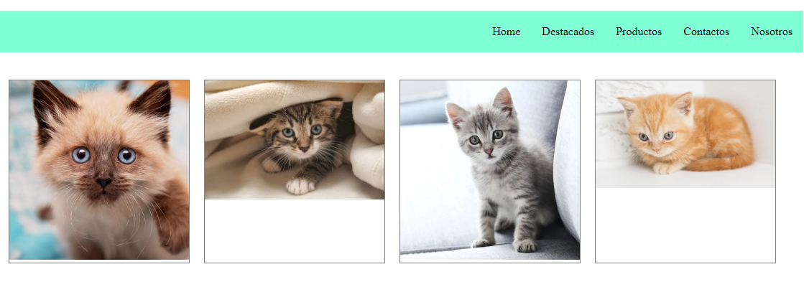

# Hola (h1)
## Buenas (h2)
### Holis (h3)

Hola buenas

Texto ***en negrito***

---
___

```javascript
console.log('buenos dias')
```

```html
<h1>Hola<h1>
```


[Linkedin](https://www.linkedin.com/in/fatima-insaurralde/)


